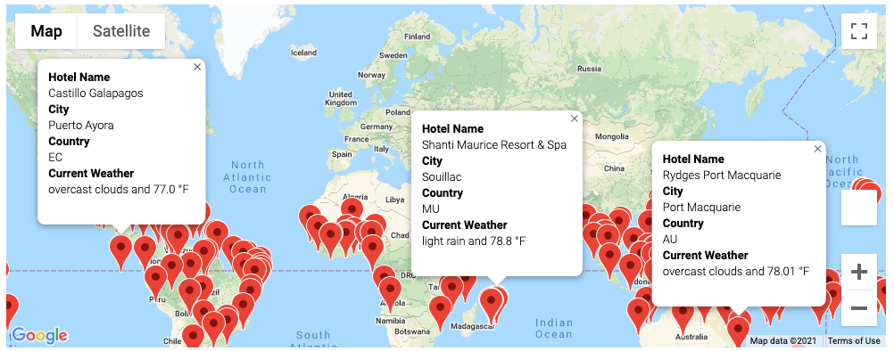
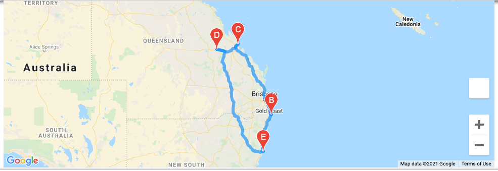

# World Weather Analysis

## Overview of Project
This project will look to make use of weather data of cities collected using APIs from the OpenWeatherMap in order to source real-time requests for ideal hotels in destinations for travelers. 

## Summary
The geographic basis of the project was sourced using nearest cities retrieved from a set of 2,000 randomly generated latitudes and longitudes. The resulting product will take minimum and maximum desired temperatures inputs from the end-user, the traveler, and produce hotel locations which fit the temperature criteria. A map with markers would display using optional pop-ups the details of each hotel, city, and maximum temperature.

Additionally, the project made use of the Google Directions API to create and display a route of a possible itinerary of four cities within a country with markers and detail pop-ups.

*Figure 1 – Map with Hotel Suggestions (Pop-up Markers)*

*Figure 2 – Travel Itinerary (Driving Route)*

